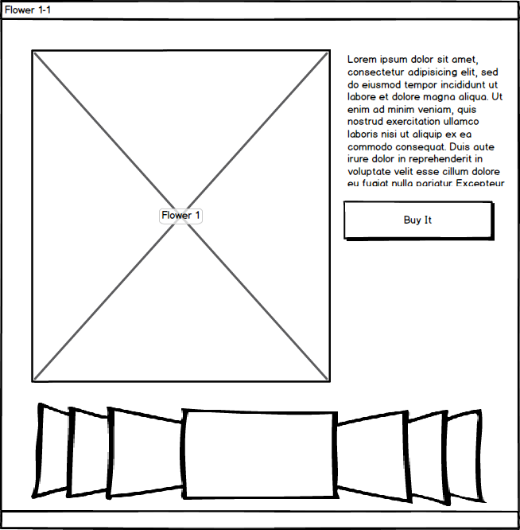
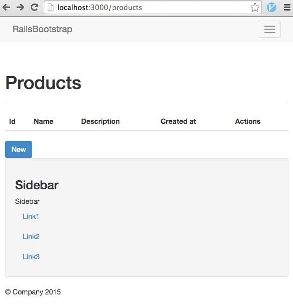
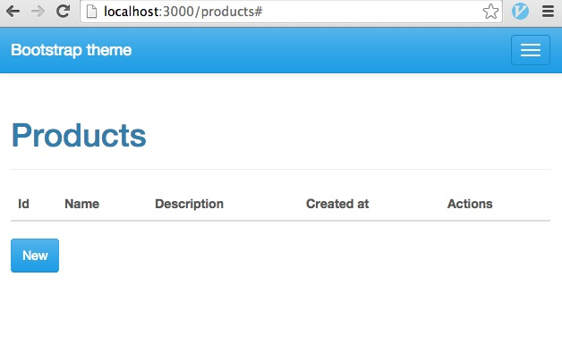
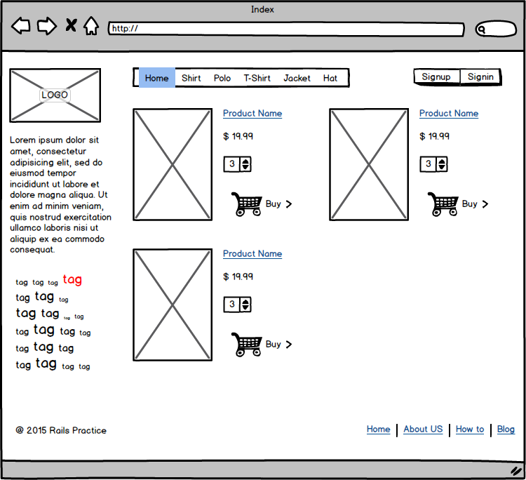
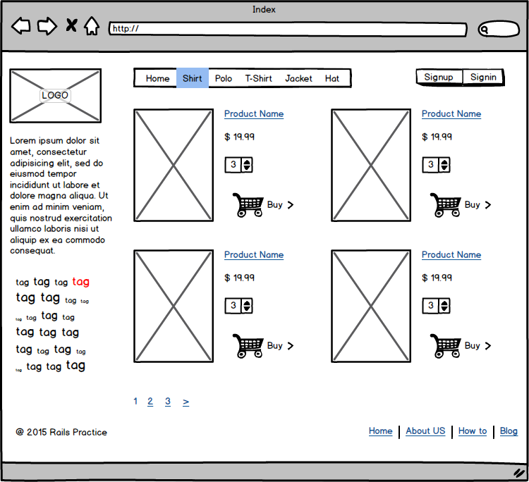
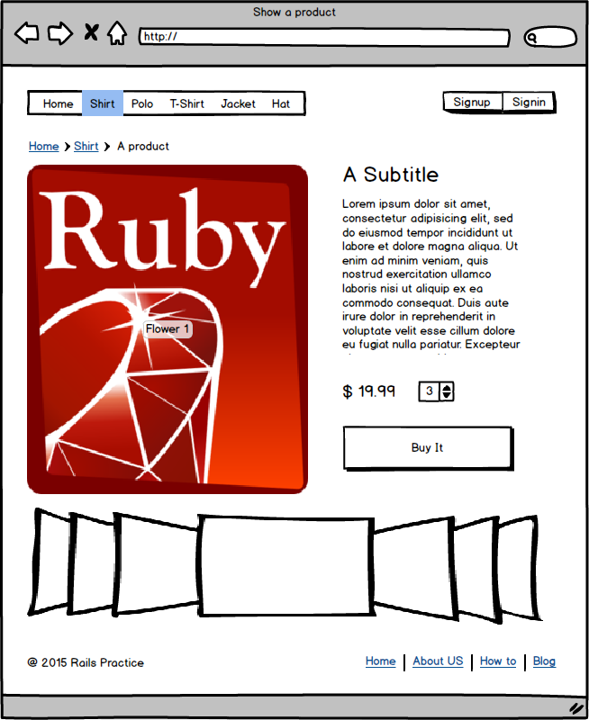

# 1.3 用户界面（UI）设计

## 概要：

本课时介绍 Bootstrap，以及 Bootswatch UI，通过 Gem，将 UI 文件安装到 Rails 项目中。介绍项目 UI 设计思路及工具。

## 知识点：

1. Bootstrap 介绍
2. Bootswatch 工具及 Gem
3. mybalsamiq 工具

## 正文

### 1.3.1 Bootstrap

大家好，在编写我们项目代码之前，我先讲一个故事。有一次，一个客户找到我们，说要开发一个卖花的网站，因为新品即将上市，所以有一些急。于是，我们给出了厚厚的几页所谓的“设计方案”。但是客户几分钟就否定了，说：“我们的项目很简单，只需要购买者看到新品就可以，可以预定，我们货到付款”。于是，我们把多余的设计去掉后，之前那份设计方案只剩下三分之一了。但是客户又很快否定了我们的方案，说：“我能先看看样子么？”

于是，我们让设计师设计好了几个样子，交给客户，客户又把我们否定了，而且显得不耐烦。他抓取一张纸和一支铅笔，在纸上画出了他要的样子。什么样子呢？



在稍后商讨细节后，我们很快完成了代码功能。

这件事情给我的启发是：

> 代码之前，先看到样子

在客户画出样稿前，我们并不知道新品只有几种，而且这个网站只放置新品。它所突出的是在线预定和货到付款，即宣传了新品，又使用了另一种贴近新品的设计风格。

回到我们的例子，我们还没开始 Rails 项目之前，要先为它设计一个样子出来。有些难度么？我们先讲一个接下来要帮助我们的前端设计框架：Bootstrap。

> Bootstrap，来自 Twitter，是目前最受欢迎的前端框架。Bootstrap 是基于 HTML、CSS、JAVASCRIPT 的，它简洁灵活，使得 Web 开发更加快捷。[1] 它由Twitter的设计师Mark Otto和Jacob Thornton合作开发，是一个CSS/HTML框架。Bootstrap提供了优雅的HTML和CSS规范，它即是由动态CSS语言Less写成。Bootstrap一经推出后颇受欢迎，一直是GitHub上的热门开源项目，包括NASA的MSNBC（微软全国广播公司）的Breaking News都使用了该项目。百度百科

先给大家 Bootstrap 的网站


[官网](http://getbootstrap.com/)

[源代码](https://github.com/twbs/bootstrap)

[Bootstrap 中文网](http://www.bootcss.com/)

在读 [Bootstrap 起步](http://v3.bootcss.com/getting-started) 之前，我先介绍下它的特点：

* 一致的设计风格，丰富的Web组件，下拉菜单、按钮组、按钮下拉菜单、导航、导航条、面包屑、分页、排版、缩略图、警告对话框、进度条、媒体对象等
* 支持多个主流浏览器
* HTML5和CSS3开发
* 在jQuery的基础上设计，兼容大部分jQuery插件
* 平台自适应，即便在手机，pad 打开网站也没问题

> 什么？ie6？请阅读10年前的教程吧，如果还能找到的话。

在 [这里](http://v3.bootcss.com/getting-started/#examples)，你可以很快看到 Bootstrap 的模样了。接下来的章节里，我们将按照这个样子，设计我们的 shop。

```
rails new shop
```

好的，我们给它添加个几个 gem。

```
gem "therubyracer"
gem "less-rails"
gem "twitter-bootstrap-rails"
```

然后，运行

`bundle install`

之后，我们给出一个新的命令，scaffold：

`rails g scaffold product name description:text`

scaffold 命令我们将在下一章详细介绍，这里，我们创建了一个资源，Product。

然后，我们继续运行以下几个命令

```
# 更新 db 解构
rake db:migrate
# 安装 bootstrap 文件
rails generate bootstrap:install
# 创建一个 layout
rails g bootstrap:layout
# 创建资源模板
rails g bootstrap:themed Products
```

是不是还有不熟悉的命令，我们后面的章节详细介绍他们，现在，你可以运行

`rails s`

来启动 Rails 项目了，访问 `http://localhost:3000/products`，你会看到这个页面，它就是 Bootstrap 风格的页面了。


把它缩小看看



是的，即便你用手机来访问它，也不会让页面乱掉。

我们用的是这个 gem，你可以详细的看看它的文档。

[https://github.com/seyhunak/twitter-bootstrap-rails](https://github.com/seyhunak/twitter-bootstrap-rails)

### 1.3.2 Bootswatch

> 是不是太千篇一律了呀？

的确，大多数项目开始的时候都是一个样子，是件让人气馁的事情。我们来给它增加点不同。

这里再介绍一个可以帮助我们的项目，[Bootswatch](http://bootswatch.com/) 

我们把刚才的代码稍作修改，不过，建议你再新建一个 Rails 项目：

```
gem 'therubyracer'
gem 'twitter-bootswatch-rails'
gem 'twitter-bootswatch-rails-helpers'
gem 'bootstrap-sass'
```

和上面的命令稍有不同，我们运行下面的两个新命令：

```
rails g bootswatch:import cerulean # 导入一个线上的 theme
rails g bootswatch:layout products # 创建一个 layout，它是什么？我们下一节介绍。
```

注：我们使用的 Gem 中，会存在 bug，或者，版本更新导致的 Gem 不匹配， 也会引起 Bug。 这时候，我们可以帮助作者改进它。当然，你要先十分确定，它是一个 Bug！

我们可以看到



当然，事情并未像上面写的如此容易。我在为大家写这段代码的时候，就遇到了很多问题，还好，都一一解决了。你可以到[这里](https://github.com/liwei78/rails-practice-code/tree/master/chapter_1)看到我调试好的代码。

在[这里](https://github.com/liwei78/rails-practice-code/tree/master/chapter_1/rails-bootswatch)，我为大家选择了三套不同的 bootswatch theme，大家可以练习。

Bootswatch-rails 的代码在这里：

[https://github.com/scottvrosenthal/twitter-bootswatch-rails](https://github.com/scottvrosenthal/twitter-bootswatch-rails)

> Rails 和 Ruby 一样，是为有经验的开发者准备的。

作为初学者，Rails 的确会为大家提出很多问题，有些问题会占用大量的时间，让人失去耐心。虽然开发了很多年的 Rails 项目代码，我也会经常遇到各种问题。所以，请大家耐心，让我们一起
弄清思路，慢慢解决。

#### 1.3.3

本节，让我们轻松一下。

你有注意到 1.3.1 里的那张图么？对了，它是用 [www.mybalsamiq.com](https://www.mybalsamiq.com/) 画的。

让我们继续为即将开始的 shop 项目，画几张图吧。

首先，我们想想，我们需要哪些页面。

1. 首页，列出我们推荐的商品（Product）
2. 列表页，根据选择的分类，列出该分类下的商品
3. 展示页，查看每一个商品

好的，我们画出心里构思好的页面。

我们的首页



我们的列表页



我们的展示页



我想讲几个我们设计上的细节。

* 首页，我们展示的是属性为置顶（top = true）的商品。
* 列表页，我们有商品分页。
* 展示页，当前分类和导航中的分类是选中状态。

当然，我们的原型设计不止这三张图，在后面的代码阶段，我们将会根据需要，再设计其他的页面。

下一节，我们将使用 `scaffold` 这个命令，来创建我们的第一个资源。我们下一节再见。


