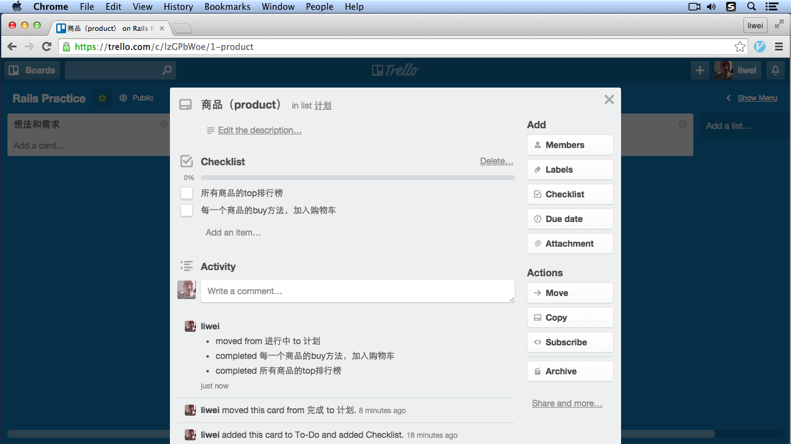

# 2.3 深入路由（routes）

## 概要：

本课时详细解读如何设置复杂情况下的路由（routes），以及路由文件中常用方法。

## 知识点：

1. routes 定义
2. 嵌套（nested）
3. namespace
4. concern
5. 参数
6. 测试

## 正文

### 2.3.1 定义路由（routes）

上一节，我们讲了 Rails 通过 routes，来实现 REST 风格的架构。本节我们讲详细介绍下如何使用 routes，定义我们想要的地址（URL）。

我们先为项目，创建一个 controller：

```
rails g controller home index welcome about contact
```

在我们专门讲解 controller 前，先简单解释下：

* g 是 generate 的缩写，我想你已经在 2.1.1 里看到了。
* controller，说明我们创建的是一个 controller，也可以是 model。
* home 是 controller 的名字。
* index... 和其他几个名字，是 controller 中的方法，并且会自动创建对应的 views 文件。

好了，我们在它上面做一些简单的例子，打开routes，你可以看到它已经增加了几个定义：

```
get 'home/index'
get 'home/welcome'
get 'home/about'
get 'home/contact'
```
我们访问 `http://localhost:3000/home/index` 可以看到它。但是，如果我想访问 `http://localhost:3000/` 就进入到 index 方法呢？

```
get '/', to: 'home#index'
get '/welcome', to: 'home#welcome'
```
如上，我们自己定义了访问和方法之间的对应关系。其实我们更经常使用 root 来定义地址：

```
root 'home#index'
```

运行 `rake routes`，我们可以看到

Prefix | Verb | URI Pattern | Controller#Action
--- | --- | --- | ---
home_contact | GET | /home/contact(.:format) | home#contact
 | GET | / | home#index
welcome | GET | /welcome(.:format) | home#welcome
root | GET | / | home#index

我们也可以用其他的 Verb 来定义非 GET 请求，比如

```
put '/haha', to: 'home#index'
delete '/hehe', to: 'home#index'
patch '/wawa', to: 'home#index'
```

routes 中我们可以抛开资源的要求（非 REST 风格），直接设定一个访问地址：

```
get '/something/:controller/:name/:action'
```

这时我们访问 `http://localhost:3000/home/aaa/index` 也会进入到 `'home#index'` 中，因为 Rails 会 这样解析：

* something 是个前缀
* 访问的 controller 是 home
* name 参数是 aaa
* 方法是 index

建议你看一下的终端：

```
Started GET "/something/home/aaa/index" for ::1 at 2015-02-19 17:10:26 +0800
Processing by HomeController#index as HTML
  Parameters: {"name"=>"aaa"}
```

Rails 已经将你的请求转移到对应的 controller 中了。

如果一个地址，即可以接收 post 请求，也可以接收 get 等请求，我们可以使用 match 方法：

```
match ':controller/:action/:id', via: [:get, :post]
```

提示：在开发（development）环境中，修改 routes 是不需要重启服务的。

#### 2.3.1.1 扩展 resources

前面我们已经定义了一个 `resource :products`，这在实际开发中还是不够的，比如，一个 Product 下如果查看评论，比如，显示卖的最好的十个 Products：

```
resources :products do
  collection do
    get :top # 排行榜功能
  end
  member do
    post :buy # 添加到购物车
  end
end
```

运行 `rake routes` 可以看到：

Prefix | Verb | URI Pattern | Controller#Action
--- | --- | --- | ---
top_products | GET | /products/top(.:format) | products#top
buy_product | POST | /products/:id/buy(.:format) | products#buy

不同的是，collection 用于 products 中增加方法，member 给具体一个 product 增加方法。

补充一点，我们可以在一行里，定义多个 resources，比如：

```
resources :photos, :books, :videos
```
虽然方便，但不够灵活，实践中还是要按照需求调整的。

我们在这里提出了两个功能需求：top 排行榜，和添加到购物车。这里我使用 trello.com 来记录这两个需求。



我在“计划”里增加了一个 card，在 checklist 中记录了这两个需求。当我们开始功能开发的时候，可以将 card 拖动到“进行中”，当我们完成一个功能的时候，可以在 checklist 的项目前打一个√，当我们完成一个 card 的任务后，可以讲 card 拖动到“完成”中。

Rails 被很多开发团队使用，在一些开发团队中，经常会提到敏捷开发，trello 是一个很好的敏捷开发工具，可以方便的管理我们的日常工作，和记录项目进展状态。

#### 2.3.1.2 单个资源 resource

```
resource :settings
resource :profile
```

这是设定一个单数资源的方法，项目里，哪些是单数呢？比如系统设定，比如当前用户的个人信息，运行 `rake routes` 可以看到，它是没有 `:id` 这个参数的。

在这个例子里，我们还未给 settings 和 profile 创建 controller 和 view，不过这不妨碍 routes 产生我们想要的地址。

#### 2.3.1.3 选择方法

`resources` 给我们创建了七个方法，但是不见得我们都要用到，为了代码的整洁[1]，我们可以做一些排除：

```
resources :users, only: [:index, :show]
resources :products, except: [:destroy]
```

`only` 表示我们需要的方法，`except` 表示我们不需要的方法。通常，我们的确会像上面这么做，比如我们的网站只提供用户（User）的列表和查看功能，而管理功能（增删改）要在管理界面进行，而它的地址一般不会是 `/users/1/edit` 这样，而是 `/admin/users/1/edit`。

[1]这是个人癖好，有的人的确不愿意这么做，不过 Rails 给了我们让项目变得“整洁”的方法。

#### 2.3.1.5 地址解析的辅助方法

刚才，我们讲到了 `_path` 这个后缀，Rails 还有一个 `_url`。

地址 | 结果
--- | ---
products_path | '/products'
products_url | 'http://localhost:3000/products'

`_path` 和 `_url` 是 routes 的辅助方法，我们在下一章将详细介绍。

### 2.3.2 嵌套的路由（routes）


在我们定义资源的时候，有时候一个资源会有它的子资源，比如一个商品（product）会有多个商品种类（variants），当我们购买一个商品的时候，也需要选择哪个种类，比如T恤的种类氛围尺码，而每一个尺码有不同的价格。

这时该如何定义 routes 呢？

```
resources :products do
  resources : variants
end
```

运行 `rake routes`，可以看到一个商品（product）下，增加了这些routes：

Prefix | Verb | URI Pattern | Controller#Action
--- | --- | --- | ---
    product_variants | GET | /products/:product_id/variants(.:format) | variants#index
 | POST | /products/:product_id/variants(.:format) | variants#create
 new_product_variant | GET | /products/:product_id/variants/new(.:format) | variants#new
edit_product_variant | GET | /products/:product_id/variants/:id/edit(.:format) | variants#edit
     product_variant | GET | /products/:product_id/variants/:id(.:format) | variants#show
 | PATCH | /products/:product_id/variants/:id(.:format) | variants#update
 | PUT | /products/:product_id/variants/:id(.:format) | variants#update
 | DELETE | /products/:product_id/variants/:id(.:format) | variants#destroy

我们为 variants 也使用一下 `scaffold`：

```
rails g scaffold variant product_id:integer price:decimal size
```

在运行 `rails s` 前，记得要更新数据库：

```
rake db:migrate
```

记得，我们应该删除 routes 中自动添加的 `resources :vriants`，因为我们不需要在 `http://localhost:3000/variants` 下看到它，不是么？我们可以在每一个商品（Product）页面，比如：`http://localhost:3000/products/1` 中看到它了。

### 2.3.3 路由中的命名空间（namespace）

接下来我们说两个项目中经常会见到的情形。

一个项目，肯定要有 admin 的，我们如何把管理地址都放到 http://localhost:3000/admin/ 这个目录下？

```
namespace :admin do
  resources :products
end
```

这时，这样就足够了，不过，它所使用的 controller 和 view 是在 admin 这个文件夹下面的，多说一点，它的controller 代码也是在 Admin 这个 module 下的。如果你还对 Ruby 的 module 不熟悉，是时候补充下了。

它的代码是：

```
class Admin::ProductsController < ApplicationController
  ...
end
```

这里，我们反过来想，能否让 `/admin/articles` 下的代码去访问 ArticlesController ？这里不再是 `Admin::` 开头的。这时我们用到 `scope`：

```
scope '/admin' do
  resources :articles
end
```

对于 admin 下的资源管理，可以试试 active admin 这个 Gem。

[https://github.com/activeadmin/activeadmin](https://github.com/activeadmin/activeadmin)

### 2.3.4 concern 方法

再来看一个让 routes 更简洁，也很实用的方法。

```
concern :commentable do
  resources :comments
end

concern :image_attachable do
  resources :images, only: :index
end

resources :messages, concerns: :commentable
resources :articles, concerns: [:commentable, :image_attachable]
```

`concern` 定义好的资源，可以被其他 resource 里多次引用。

Rails 的原则之一：`不要重复自己（Don't Repeat Yourself）`

### 2.3.5 有用的参数

#### :as 别名

如果再上面地址后面，加上 `as` 参数，会直接创建一个别名的地址，比如

```
get 'home/welcome', as: :welcome
```

之前，我们在 views 或者 controller 中，连接到或跳转到 `/home/index` 可以这么写：`home_welcome_path`，增加了 `:as` 后，就变成了 `welcome_path` 了。好处是，如果我们某一天更改了对应的 action 甚至 controller，这个写法 `welcome_path` 是不会变的，而只需要改动 routes 中的定义。

在定义 routes 时，要注意不要重复定义，因为：写在上面的会覆盖下面的。比如：

```
get 'home/index', to: 'home#welcome'
get 'home/index'
```
访问 `http://localhost:3000/home/index` 会进入到 `welcome` 方法中。

下面在介绍几个实用的参数。

#### shallow

这时 Rails 4 中增加的一个很实用的参数。

```
resources :products do
  resources :comments, shallow: true
end
```

它把 index、new 和 create 方法保留在了 `products/:id` 这个资源下，而把其他方法，重新放回到 `/comments` 下。这样的考虑是避免过多的实用嵌套 routes，并且让代码更简洁。

#### constraints

我们可以给 routes 建立约束（Constraints），比如：

```
get 'photos/:id', to: 'photos#show', constraints: { id: /[A-Z]\d{5}/ }
```

这时，id 为 A 到 Z 开头，且后面为5位数字的 id，才符合路由条件，转入到 `show` 方法。而 `products/A123456` 将会提示 `No route matches`。

### 2.3.6 Rspec 测试

通常，我们会在 controller 中写上测试，不过 Rspec 也为我们提供了测试路由的方法。我们在 spec 下建立一个routing 文件夹，并且添加一个 `products_routing_spec.rb` 的文件：

```
RSpec.describe ProductsController, type: :routing do
  describe "routing" do

    it "routes to #index" do
      expect(:get => "/products").to route_to("products#index")
    end
    ...
```

我们为它单独运行测试，因为scaffold 自动为我们添加的测试代码，我们将在后面的章节完成：

```
% rspec spec/routing/products_routing_spec.rb
```

routes 测试的参考，可以查看[这里](https://github.com/rspec/rspec-rails#routing-specs)。

好了，本章结束了，本节的内容多来自 Rails 手册中的 [Rails Routing from the Outside In](http://guides.rubyonrails.org/routing.html)，你也可以找到在 [这里](https://github.com/liwei78/rails-practice-code) 找到本章调试的代码。下一章，我们将开始完成 shop 的页面（views）代码，希望它可以让你更加了解 Rails。


