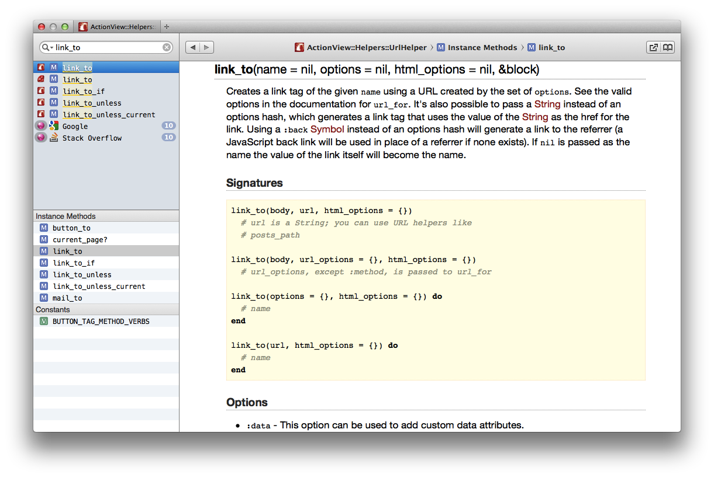

# 第三章 Rails 中的视图

## 课程概要：

本课程讲解Rails 视图（View），内容包括常用的辅助方法（Helper），如何使用表单（Form），AJAX在视图中的应用以及如何借助其他的模板引擎实现简洁的页面方案。

## 知识点：

1. 布局
2. 辅助方法
3. 表单
4. AJAX
5. 模板引擎

## 课程背景

视图（View）即 MVC 中的 V，也是Rails使用者最先见到的部分。在完成业务逻辑前，合理的设计视图是 MVC 开发中最先得到用户认可的部分。本课程结合商品页面的开发，讲解Rails 中的视图。

# 3.1 布局和辅助方法

## 概要：

本课时讲解Rails 视图（View）中的布局文件，常见的辅助方法（Helper）以及如何使用局部模板。

## 知识点：

1. 布局（layout）
2. 辅助方法（helper）
3. 局部模板（partial）

## 正文

### 3.1.1 布局（layout）

本章开始，我们将进入 Rails 的视图（view） 的开发中。如果你对 Rails 这个 MVC 框架还有一些模糊的话，建议读一读[这篇文章](http://www.ruanyifeng.com/blog/2007/11/mvc.html)。

> Rails 是一个 RESTful 风格的 MVC 框架。

我们把第一章使用 bootswatch 创建的项目 copy 过来。现在，我们进入到 `app/views` 这个文件夹吧。

`layouts` 里放的是布局文件。如果我们网站只有一种布局，那么一个 `application.html.erb` 就足够了。我们也可以为每个资源创建一个 `layout`，比如 `app/views/layouts/products.html.erb`。

我们删掉多余的代码，增加一个 `yield` 的辅助方法（helper）。

```
 <div class="container">
   <%= yield %>
 </div>
```

访问我们的[页面](http://localhost:3000/)，希望你会看到和我一样的效果。如果没有，没关系，可以到 [这里](https://github.com/liwei78/rails-practice-code) clone 我们的代码。


`yield` 方法可以让 Rails 使用我们的模板（template） `app/views/products/index.html.erb` 填充了布局（layout）。

我们再看一下 `app/views/layouts/application.html.erb` 中的这一行：

```
<%= yield(:page_stylesheet) if content_for?(:page_stylesheet) %>
```

如果我们在 `app/views/products/index.html.erb` 中使用 `content_for` 方法，可以在这个layout 的这个位置，显示额外的内容，比如，我们在 `index.html.erb` 的最上面增加：

```
 <%= content_for :page_stylesheet do %>
 <!-- 这是 index.html.erb 里单独使用的 -->
 <% end %>
```

再刷新下[页面](http://localhost:3000/)，我们在源码里看到：


在实践开发里，我们经常这样做：布局中加载的是所有页面通用的内容和 css，js，而到了具体页面，就通过 `content_for` 这个辅助方法定义自己的内容，在我们的 `application.html.erb` 里，你可以找到四个 `content_for`，这样给我们的代码里增加了一些灵活，也不必把所有内容都写到一起。

`content_for?` 判断我们是否定义了这个变量。

如果我们想更改一下布局，该如何做呢？实践中，我们的确会遇到以下几种情形：

#### 情形一：admin 要使用自己的布局文件 `app/views/layouts/admin.html.erb`

我们在 admin 的 controller 里声明它使用另一个：

```
class AdminController < ApplicationController
  layout "admin"
```

通常我们把 admin 放到 module 中，而为 admin 建立一个通用的 controller，让所有 admin 的 controller 都继承它，这样，我们不用反复的去定义了：

```
class Admin::BaseController < ApplicationController
  layout "admin"
end

class Admin::ProductsController < Admin::BaseController
end

class Admin::CommentsController < Admin::BaseController
end
```

#### 情形二：为完成某个特殊操作，我们需要更改布局。

这时，我们要在 action 里去变更这个布局，比如，创建一个 Product 的时候：

```
def new
  @product = Product.new
  render layout: "another_layout"
end
```

#### 情形三：不用布局

```
def edit
  render layout: false
end
```

### 3.1.2 常用的辅助方法（helper）

上一节，我们已经使用了几个辅助方法，这里我们再介绍几个 [Layouts and Rendering in Rails](http://guides.rubyonrails.org/layouts_and_rendering.html) 提到的 helper。

#### link_to

你会发现在页面里最多的是 link_to 这个方法，它的参数也是蛮多的，我们来详细讲解。

我们把现在的 view 修改一下，把 `首页` 的链接加上。

```
<%= link_to "网店演示", root_path, class: "navbar-brand" %>
```

一个稍复杂的例子：

```
<%= link_to "删除", product, :method => :delete, :data => { :confirm => "点击确定继续" }, :class => 'btn btn-danger btn-xs' %>
```

我们可以改变 `link_to` 的默认行为（GET），`:method => :delete` 将发送 `delete` 请求。`:confirm` 将会告诉浏览器阻止我们当前的动作，直到点击 `确定`。实现上面两个效果，需要引入 `ujs`, 在我们的 `app/assets/javascripts/simplex.js`[1] 中已经为我们引入了：

```
//= require jquery
//= require jquery_ujs
```

注[1]：通常我们使用的是 `application.js`，但是在 1.3 中我们设计了新的主题，目前我使用的是 `simplex`。

写到这里，我要推荐 [http://api.rubyonrails.org/](http://api.rubyonrails.org/) 这里了，对于各种 Rails 本身的方法，我们可以通过查询 api 文档得到。如果是某个 Gem 提供的方法，我们可以直接翻看它的 README 或者代码。

一个较实用的工具 Dash，可以帮你管理每个版本 api 文档，查询起来也很方便。不过它是收费的。



#### image_tag

建议你使用 api 文档查找一下这方法，你会看到这个代码提示：

```
image_tag("icon")
# => 
image_tag("icon.png")
# => 
image_tag("icon.png", size: "16x10", alt: "Edit Entry")
# => 
image_tag("/icons/icon.gif", size: "16")
# => 
image_tag("/icons/icon.gif", height: '32', width: '32')
# => 
image_tag("/icons/icon.gif", class: "menu_icon")
# => 
```

我们的图片是来自 `app/assets/images` 的，我放了一个 `logo.png` 在里面，你会发现它的地址是：`http://localhost:3000/assets/logo-be2e3e66a18126c4042f84cd4aae4cb3.png`。Rails 使用 [sprockets-rails](https://github.com/rails/sprockets-rails) 来管理 `app/assets` 中的文件，后面章节我们会详细介绍。

这里，我们可以关闭 `be2e3e66a18126c4042f84cd4aae4cb3`这种形式：

`config/environments/development.rb`

```
config.assets.digest = false
```

重启我们的服务，地址变为 `http://localhost:3000/assets/logo.png`。

#### auto_discovery_link_tag

我们经常在 `head` 里和页面里，增加 rss 和 atom 订阅连接，这时，我们可以使用 `auto_discovery_link_tag` 这个辅助方法。

```
<head>
...
<%= auto_discovery_link_tag(:rss, {controller: "products", action: "index"}, {title: "RSS Feed"}) %>
<%= auto_discovery_link_tag(:atom, {controller: "products", action: "index"}, {title: "ATOM Feed"}) %>
...
</head>
```

我们也可以在页面中增加这个连接，这在 web2.0 兴起后的博客中很常见，方便我们把数据加入到订阅中。

```
<%= link_to "rss", products_url(format: "rss") %>
<%= link_to "atom", products_url(format: "atom") %>
```

剩下的问题是， Rails 如何提供这个数据，我并不想等到 controller 里再去讲这个部分，让我们现在开始了解下：

> Rails 是会根据我们的请求类型，做出响应。

如果我们请求的是一个 `http://localhost:3000/products.html`，Rails 会给我们 html 的页面，而如果我们请求的是 `http://localhost:3000/products.rss`，Rails 会自动选择 rss 的模板，渲染（render）后返回我们结果。`http://localhost:3000/products.atom` 也是一样。 所以，我们在 `app/views/products/` 中增加两个文件：`index.rss.builder` 和 `index.atom.builder`。

在 controller 里，如果我们想对结果做一些其他的操作，就需要增加这个代码：

`app/controllers/products_controller.rb`

```
respond_to do |format|
  format.html
  format.rss { ... }
  format.atom { ... }
end
```

在这个例子中，我们并不需要改变什么，所以不用添加它。

`app/views/products/index.atom.builder`

```
atom_feed do |feed|
  feed.title "商品列表"
  feed.updated @products.maximum(:updated_at)

  @products.each do |product|
    feed.entry product, published: product.updated_at do |entry|
      entry.title product.name
      entry.content product.description
      entry.price product.price
    end
  end
end
```

`app/views/products/index.rss.builder`

```
xml.instruct! :xml, version: "1.0"
xml.rss version: "2.0" do
  xml.channel do
    xml.title "商品列表"
    xml.description "这是商品列表"
    xml.link products_url

    @products.each do |product|
      xml.item do
        xml.title product.name
        xml.description product.description
        xml.price product.price
        xml.link product_url(product)
        xml.guid product_url(product)
      end
    end
  end
end
```

再次访问 `http://localhost:3000/products.rss` 和 `http://localhost:3000/products.atom`，你会发现我们得到了结果。

我们用到了 `.builder` 这个结尾的文件，它会告诉 Rails 使用 `Builder::XmlMarkup` 这个库（lib）来解析文件。所以看 `rss.builder`，它是按照 xml 格式写的。`atom.builder` 用到了另一个辅助方法 `atom_feed`，写法虽然不同，但是生成的内容也是 xml 格式的。

在 `scaffold` 创建的文件里，你会看到 `index.json.jbuilder`，它会使用 `JBuilder` 这个库来解析并生成 `json` 的结果。这会在后面的章节讲到，你可以在 [这里](https://github.com/rails/jbuilder) 先了解一下。

Railscasts.com 是所有 Rails 学习者必看的网站，这个 [视频](http://railscasts.com/episodes/87-generating-rss-feeds-revised) 一定会帮助你理解上面的内容。

在此，向 Ryan 致敬。

#### stylesheet_link_tag

```
<head>
<%= stylesheet_link_tag "simplex", :media => "all" %>
</head>
```
css 文件的引用通常放到页面的 `head` 标签之间。这里我们引用的是 css 文件，我们也可以把它改为 `.css.scss`，这样可以在里面写一些 `scss` 语法，而不用更改我们的引用。我们在 `2.1.3` 中已经提到了 `scss`。

#### javascript_include_tag

```
...
<%= javascript_include_tag "simplex" %>
<%= yield(:page_javascript) if content_for?(:page_javascript) %>
</body>
```

浏览器是自上而下解析节点元素（DOM）的，所以，请注意我们把 `js` 文件加载放到页面最下面，以免因为某个 js 解析问题导致页面始终无法显示。在引用完 `js` 库后，我们还可以根据需要，单独放置页面的 `:page_javascript`。

ActionView 还为我们提供了其他很多辅助方法，可以查看 [这里](http://guides.rubyonrails.org/action_view_overview.html#overview-of-helpers-provided-by-action-view)。

### 3.1.3 局部模板（partial）

为了让我们节省更多的页面重复代码，我们还可以使用局部模板（partial）。打开我们的 `app/views/products/index.html.erb`：

```
<% @products.each do |product| %>
  <%= render partial: "product", locals: { product: product } %>
<% end %>
```

这里我们使用了局部模板，`partial` 指定了使用哪个模板，`locals` 向模板里传递了一个变量。在 `_product.html.erb` 里，我们显示具体 `product` 的信息。

不过这是一个老套的写法，Rails 4 给了我们更酷的写法： 

```
<%= render @products %>
```

不过，如果需要传递更多的变量（locals），还是要用第一种方法，当然，你完全可以把 `each do` 的代码放到局部模板里。

我们也可以不传递变量到局部模板里，它可以找到 `@products`，看一下 `new.html.erb` 和 `edit.html.erb`：

```
<%= render :partial => 'form' %>
```

也可以直接写：

```
<%= render 'form' %>
```

如果我们在页面加载路径中，放置了多个同名的局部模板，它会显示离它最近的那个。我们可以把公用较多的模板，放到一个专属的文件夹里，比如 `shared`，引用的时候：

```
<%= render partial: "shared/product", locals: { product: product } %>
```

注：当使用 `locals` 传递参数时，一定要声明 `partial`。

我为大家在 `shared` 中放置了一个同样的 `_product.html.erb`，大家可以在 `index.html.erb` 中调用看看。

说一个实践中经常用到的局部模板。

我建立了一个新的文件夹 `application`，这里会放布局文件使用的局部模板，我放了一个 `_flash.html.erb`，这是 `flash` 通知。看看我们的 `products_controller.rb`，我们在操作成功后会有提示信息，它在我们的页面上还没有显示。我修改了一下 `application.html.erb`：

```
 <div class="container">
   <%= render "flash" %>
   <%= yield %>
   ...
```

为了让 `flash` 符合 `bootstrap` 的格式，我做了代码调整，大家可以参考代码。`flash` 是 session 的应用，通常在 controller 的 `action` 间传递信息，读取成功后自动清空。如果一个 flash 没有在合适得地方读出来，那么它将被保存到读出为止，这会造成本不该显示它的地方却显示它，所以我把 `flash` 放到了 `layout` 中，使得所有页面都会引用它，保证它产生后立刻显示，并在显示后自动清空。

